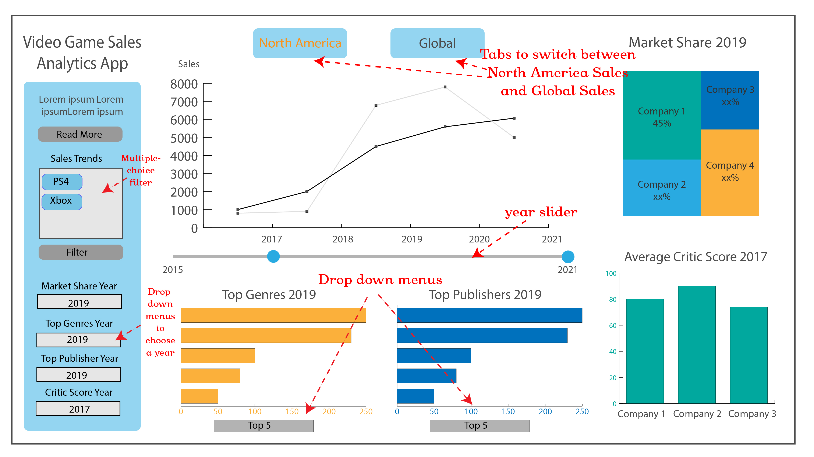

Video Game Sales Analytics Dashboard
================
Amelia Tang, Alex Yinan Guo, Yike Shi, and Mahmoodur Rahman

## Background

Electronic video games in 2020 generated a revenue of around $165
billion. To thrive in this competitive industry, video game companies
have sales analysts who need to keep their eyes on stats relating to
sales. Our dashboard can easily present the necessary stats relating to
video games sales, by a user-friendly interface.

## Data

The data used in this dashboard is drawn from
[Kaggle](https://www.kaggle.com/sidtwr/videogames-sales-dataset?select=Video_Games_Sales_as_at_22_Dec_2016.csv),
which has 11563 observations.

## Methodlogy

The dashboard performs exploratory data analysis by filtering several
traits such as `Platform`, `Year_of_Release`, `Genre`, `Publisher`,
`Developer` etc. More in details in our [proposal](docs/proposal.md).

## Design

#### Description

The app contains a landing page that by default shows the North America
sales line plot for PlayStation4, top publishers in the most recent
years for PlayStation4, top genres for the most recent years for
PlayStation4, a chart shows market share of the major players in the
industry in the most recent year and an average critic score of
PlayStation4 in the most recent year. On the top of the page, a user can
use the tabs to navigate between the North America and global sales to
show sales trends in North America, other regions (under the `global`
tab), and the sales trend globally (under the `global` tab). Moreover, a
user can use the year slider under the sales line plot to choose the
range of years of sales he/she would like to view. From the filter on
the side bar, a user can choose to show sales of different companies,
including but not limited to PS4, Xbox and Wii. In addition, a user can
also use the drop down menus on the side bar to choose the year of top
publishers, top genres, market share and average critic score he/she
would like to view. At the bottom of the `Top Genre` and `Top Publisher`
charts, a user can choose how many top genres or publishers he/she want
to see from 5 to 10.

#### Sketch

## Contributing to this Dashboard

If you have some ideas regarding this project and wish to help, please
review our [contributing guidelines](CONTRIBUTING.md).

## License

`Video Game Sales Analytics Dashboard` dashboard is licensed under the
terms of the MIT license.
